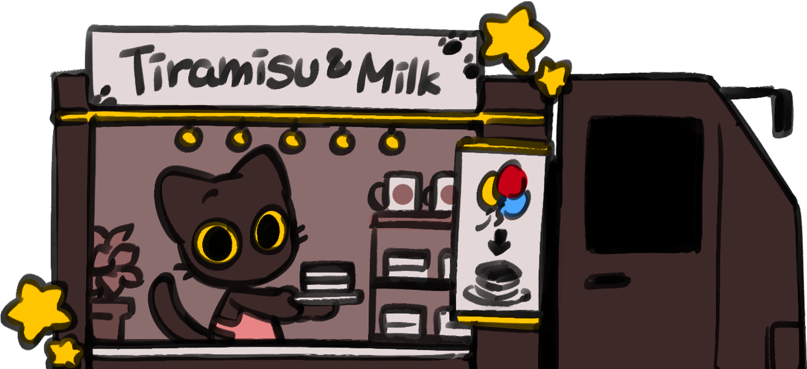
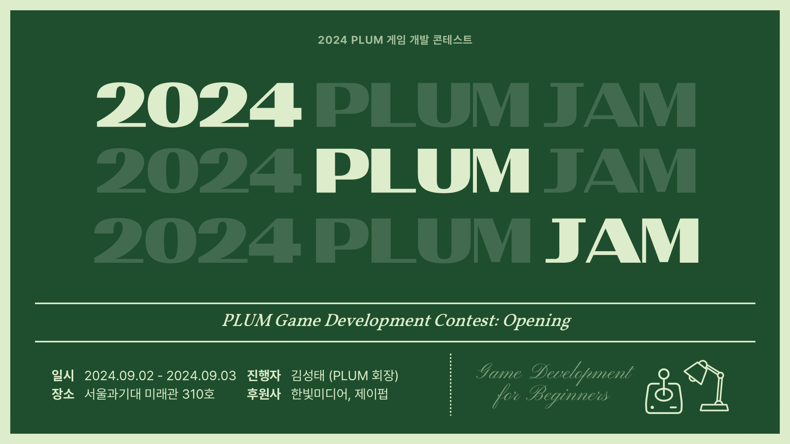
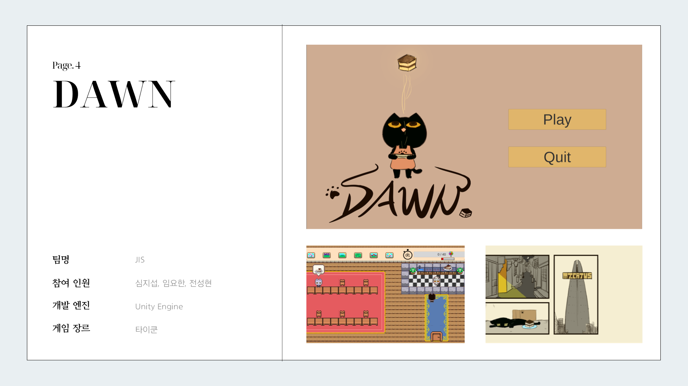
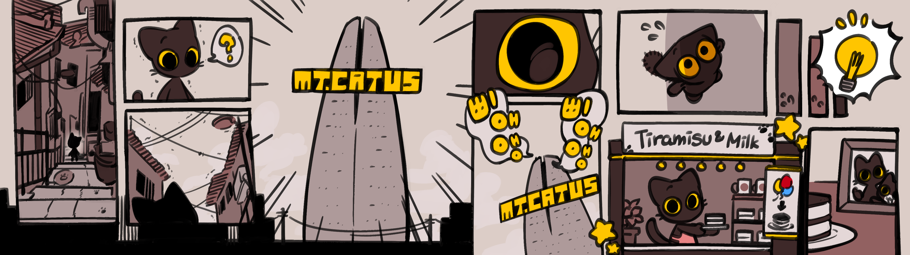
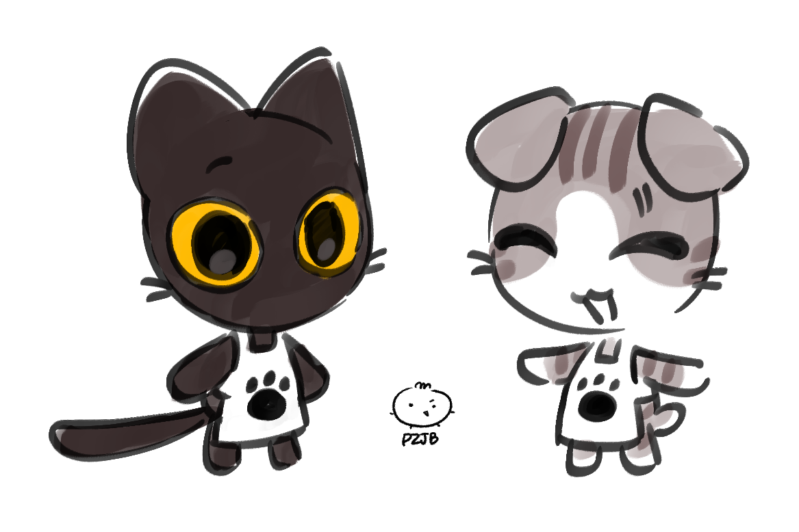
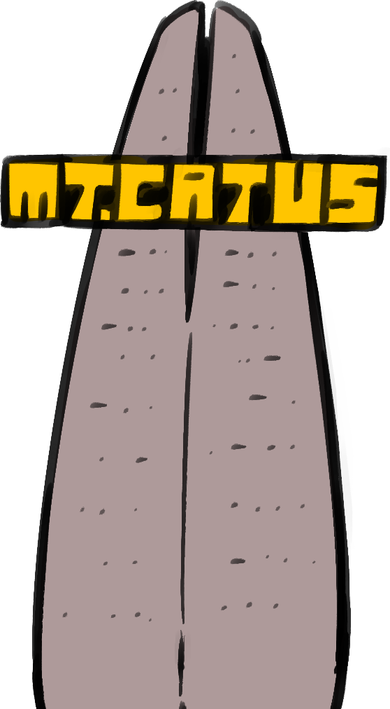
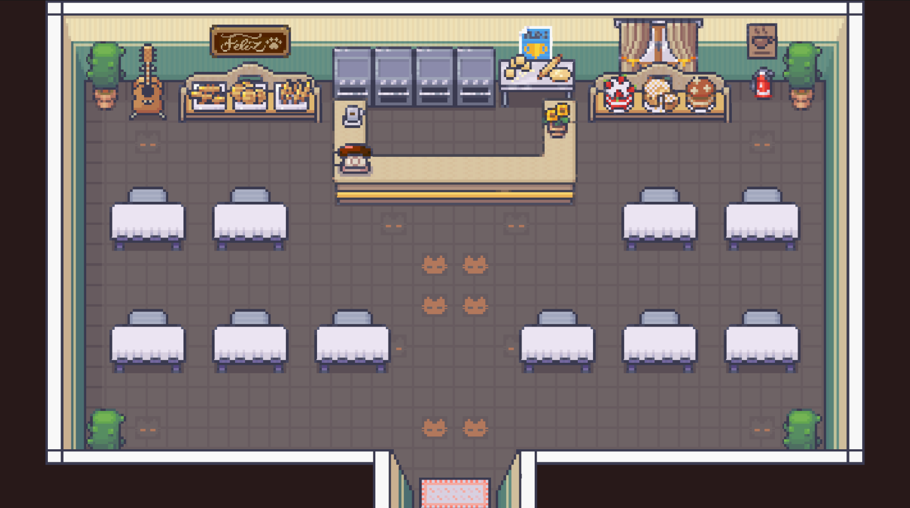
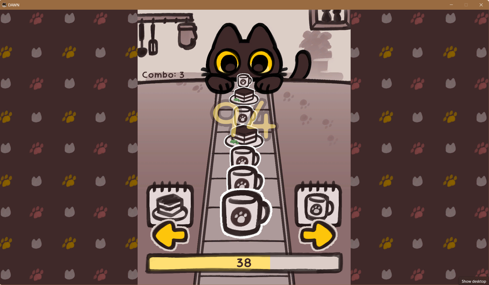
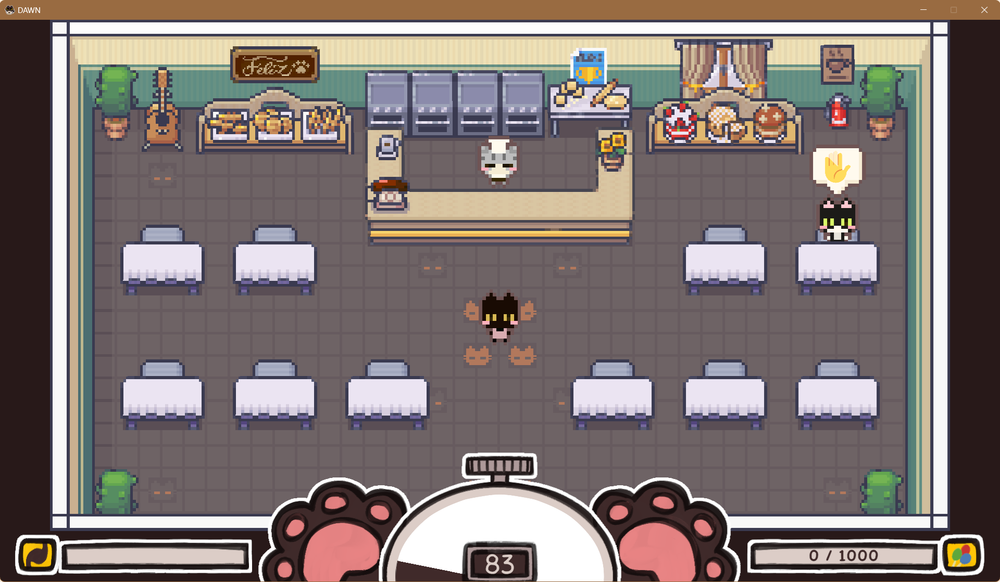

# 🐈‍⬛ DAWN
**DAWN** is a chaotic bakery tycoon adventure in Bakery Feliz.  
  
<ins>※ We highly recommend checking the **control keys** before playing the game.</ins>

---

## 📋 Table of Contents
1. [Game PV](#-game-pv)
2. [Contributors](#-contributors)
3. [Motivation](#-motivation)
4. [Story](#-story)
5. [Control Keys](#-control-keys)
6. [How to Play](#-how-to-play)
7. [Implemented Features](#-implemented-features)
8. [License](#-license)
9. [References](#-references)
10. [Development Status](#-development-status)

---

## 🎥 Game PV
[](https://www.youtube.com/watch?v=G1nTNvpd6xU)  
▲ DAWN PV (95s): Click to visit the link.

---

## 👥 Contributors
### Initial Development
- **<a href="https://github.com/Hyuni02" target="_blank"> Sunghyun Jeon </a>** - Original planner of DAWN, implemented game logic, and conducted overall development.
- **<a href="https://github.com/JisubShim" target="_blank"> Jisub Shim </a>** - Implemented the chef and interaction systems, refactored the overall code.
- **<a href="https://github.com/YohanIm00" target="_blank"> Yohan Im </a>** - Designed artwork, implemented the player, and handled minor development tasks.

### Game PV
- **<a href="https://github.com/RuneLune" target="_blank"> Seungyong Park </a>** - Edited video and sound.
- **<a href="https://github.com/JisubShim" target="_blank"> Jisub Shim </a>** - Created and selected video content (Vidu).
- **<a href="https://github.com/YohanIm00" target="_blank"> Yohan Im </a>** - Wrote the PV script.
- **<a href="https://github.com" target="_blank"> Yoonseok Jung </a>** - Produced still images (MidJourney).

### Follow-up Development
- **<a href="https://github.com/YohanIm00" target="_blank"> Yohan Im </a>** - Reconstructed game scenes and implemented additional features.
- **<a href="https://blog.naver.com/pz_jb_008" target="_blank"> Dahye Im </a>** - Redesigned the entire game artwork.

---

## 💡 Motivation
  
DAWN was created as part of the 2024 PLUM JAM, a summer program hosted by the PLUM game development club.  
PLUM JAM is a game development hackathon where participants create games based on given keywords.  
At the time, the keywords were 'Tiramisu Cake' and 'Balloon.'  
After much deliberation on how to integrate these themes, the idea of "a cat selling tiramisu to ascend to great heights with a bundle of balloons" was born.  


---

## 📖 Story
### Synopsis
  
There is Wand the black cat with an exceptional talent for making tiramisu cakes.  
One day, he gotta be captivated by the sudden appearance of the colossal cat tower, MT.CATUS.  
As Wand gazes at the tower in awe, a familiar meow echoes from the peak.  
Realizing it’s his sibling, Wand starts pondering how to overcome this situation.  
At that moment, a brilliant idea flashes through Wand’s mind:  

"Trade tiramisu cakes for balloons, and use them to float to the top!"  

The goal is 1,000 balloons! Will our Wand manage to gather enough balloons to reunite with their sibling?

### Characters
  
▲ Character concept art: Wand on the left, Pu on the right.

- **Wand**  
  - A black domestic shorthair cat with striking amber eyes.  
  - Known as "Tiramisu Hand" for their unique ability to turn any ingredient into a tiramisu cake.  
  - Typically very quiet, often leaving others confused about what they want to say.  

- **Pu**  
  - A gray-patterned Scottish Fold cat, usually seen with their eyes closed.  
  - The head chef of Bakery Feliz, with great pride in their culinary skills.  
  - For some unknown reason, Pu seems to understand Wand’s unspoken words perfectly.  

- **(Future Characters)**  
  - Look forward to the next version for new additions!

### Environment
- **The Village**  
  - A common hillside neighborhood that looks like it could exist anywhere, but it’s uniquely inhabited only by cats.  

- **MT.CATUS**  
    
  - An ultra-high "cat tower" that suddenly appeared in the center of the village.  
  - The top of the tower features a prominent sign reading "MT.CATUS."  

- **Bakery Feliz**  
    
  - A bakery run by Pu.  
  - Due to the nocturnal nature of most cats, the number of customers increases as time goes on.  
  - Interestingly, Pu runs the bakery based on their whims and often closes during peak hours.  

---

## 🎮 Control Keys
### Sorting Game
- **Arrow Keys**  
  - (Left Arrow): Serve tiramisu.  
  - (Right Arrow): Serve milk.

### Main Game
- **Arrow Keys**  
  Move the character up, down, left, and right.  
- **Spacebar**  
  Interact during cutscenes and dialogues.  
- **S** : **S**erving  
  - (Customers): Take orders, serve completed dishes.  
  - (Chef): Place orders, collect prepared dishes.  
- **E, R** : l**E**ft & **R**ight  
  - (E): Eat the food in the left hand.  
  - (R): Eat the food in the right hand.

---

## 🕹️ How to Play
### Sorting Game
  
- A simple sorting game that can be played using only the right and left arrow keys.  
- If you correctly process 20 consecutive orders, FEVER mode will be activated.  
  - During FEVER mode, pressing any arrow key will increase your score.  
  - FEVER mode lasts for 3 seconds.  

https://github.com/user-attachments/assets/993116aa-4535-436f-b4dd-035a43bcf69d  

- If you press the wrong arrow key at any point, your score will decrease.  
  - The higher your current score, the more points you will lose, so be careful!  

https://github.com/user-attachments/assets/104ba434-0cb4-4484-b46b-3eed2a7faebf  

- Aim for the highest score possible within the time limit!  
  - ~The score is supposed to carry over as the initial value in the main game.~  
  - However, it was discovered that this functionality does not work as intended.  
  - This issue will be addressed in the "Development Status" section later.  

### Main Game
  
- When a customer places an order, approach them and press the **S key** to take their order.  
  - If you don’t take the order on time, the customer will leave angrily.  
  - Angry cat customers will pop balloons as a consequence, so be careful!  

https://github.com/user-attachments/assets/8d208f0a-827e-4df0-a9bc-1af138e30eb8  

- After taking an order, approach the chef Pu and, press the **S key** to start cooking.  
  - You can take up to 10 orders at a time and cook up to 4 menu items simultaneously.  
  - Cooking time depends on the menu item and is either 3 seconds or 5 seconds.  

https://github.com/user-attachments/assets/34d52ec0-2934-4d97-854a-602c63b5059b  

- Once the cooking is complete, you’ll hear the oven’s signature completion sound, and the dish will appear on the counter.  
  - Similarly, press the **S key** at the counter to pick up the dishes in the order they were prepared.  
  - You can carry up to two dishes at a time.  

https://github.com/user-attachments/assets/e33bb205-342f-4510-8bfc-52ac79a69e9d  

- Take the completed dishes to the customer and press the **S key** to serve them.  
  - If the dish matches the customer’s order, they’ll eat it happily and reward you with balloons.  
  - If the dish doesn’t match the order, there will be no reaction. Double-check the orders!  
  - Additionally, you **cannot take new orders while holding dishes.** Serve the dishes first, then take the next order.  

https://github.com/user-attachments/assets/e38536f7-1a1b-4a6c-9153-6433d3f904f5  

- If a mistake during serving leaves you with leftover food, you can press **E** or **R** to eat the food in your hands.  
  - Eating food will increase your fullness level.  

https://github.com/user-attachments/assets/a116463d-8da6-4d42-b49b-0d26bd47ee7d  

  - However, if your fullness level maxes out, you’ll temporarily slow down, so watch out!  

https://github.com/user-attachments/assets/cfe9a394-ec34-4da0-8a28-196500c2df55  

---

## ⚙️ Implemented Features
- **Engine**: Unity  
- **Programming Language**: C#  
- **Key Implementations**:
  - **Singleton Pattern**: Used for components like `AudioManager`, `GameManager`, etc.  
    - **AudioManager**:
    ```csharp
    public class AudioManager : MonoBehaviour
    {
        public static AudioManager instance;
        public AudioClip[] bgmClips;
        public float bgmVolume;
        private AudioSource bgmPlayer;
        public enum BGM { MainMenu, Prologue }
    
        private void Awake()
        {
            instance = this;
            Init();
        }
    
        private void Start()
        {
            bgmPlayer.Stop();
    
            if (SceneManager.GetActiveScene().name == "MainMenu")
                PlayBgm(BGM.MainMenu);
            else if (SceneManager.GetActiveScene().name == "Prologue")
                PlayBgm(BGM.Prologue);
        }
    
        private void Init()
        {
            GameObject bgmObject = new GameObject("BGM Player");
            bgmObject.transform.parent = transform;
            bgmPlayer = new AudioSource();
        
            bgmPlayer = bgmObject.AddComponent<AudioSource>();
            bgmPlayer.playOnAwake = false;
            bgmPlayer.loop = true;
            bgmPlayer.volume = bgmVolume;
        }
    
        public void PlayBgm(BGM bgm)
        {
            bgmPlayer.clip = bgmClips[(int)bgm];
            bgmPlayer.Play();
        }
    
        public void VolumeController(float volume)
        {
            bgmVolume = volume;
            bgmPlayer.volume = bgmVolume;
        }
    }
    ```
    - **Explanation**:  
      - Elements that need to remain active throughout the game were implemented using the Singleton pattern.  
      - Background music is set for each scene and declared using the `enum BGM` type.  
      - Since the class is implemented as a Singleton, its methods can be called anywhere using `AudioManager.instance.VolumeController(0)`.  

  - **State Pattern**: Used for `Player` and `Customer`.
    - **CustomerStateMachine.cs**
    ```csharp
    public class CustomerStateMachine : MonoBehaviour
    {
        public CustomerState Order;
        public CustomerState Enjoy;
        public CustomerState currentState;
        
        private void Start()
        {
            Order = gameObject.AddComponent<OrderingState>();
            Enjoy = gameObject.AddComponent<EnjoyingState>();
    
            ChangeState(Order);
        }
    
        public void ChangeState(CustomerState newState)
        {
            currentState?.Exit();
            currentState = newState;
            currentState?.Enter(this);
        }
    }
    ```
    - **CustomerState.cs**
    ```csharp
    public abstract class CustomerState : MonoBehaviour
    {
        protected CustomerStateMachine stateMachine;
        protected Customer customer;
    
        public virtual void Enter(CustomerStateMachine stateMachine)
        {
            this.stateMachine = stateMachine;
            customer = GetComponent<Customer>();
            customer.timer.fillAmount = 1;
        }
    
        public abstract void _Update();
        public abstract void Exit();
    }
    ```

    - **EnjoyingState.cs**
    ```csharp
    public class EnjoyingState : CustomerState
    {
        private float maxTime;
    
        public override void Enter(CustomerStateMachine stateMachine)
        {
            base.Enter(stateMachine);
            customer.enjoyingTime += Random.Range(0, 2);
            maxTime = customer.enjoyingTime;
            GameManager.instance.GainBalloon(true, customer.menu.GetCookingTime());
        }
    
        public override void Exit() {}
    
        public override void _Update()
        {
            customer.enjoyingTime -= Time.deltaTime;
            customer.timer.fillAmount = customer.enjoyingTime / maxTime;
            
            if (customer.enjoyingTime < 0)
                stateMachine.ChangeState(stateMachine.Leave);
        }
    }
    ```

    - **Explanation**:  
      - Objects with behavior that changes based on interaction were implemented using the **State Pattern**.  
      - The base for all states is an abstract class, which is inherited to create specific state implementations.  
      - A state machine was designed to allow seamless transitions between states as needed, and this was integrated into the primary object, as shown below.

    - **Customer.cs**
    ```csharp
    public class Customer : MonoBehaviour
    {
        public CustomerStateMachine stateMachine;
    
        private void Awake() { stateMachine = gameObject.AddComponent<CustomerStateMachine>();}
    
        public void Update() { stateMachine.currentState._Update();}
    
        public void OnDestroy() { GameManager.instance.customers.Remove(gameObject); }
    }
    ```

    - **Summary**:  
      - The `CustomerStateMachine` manages state transitions for customers.  
      - Abstract state (`CustomerState`) provides the structure, while specific behaviors are implemented in concrete states (`EnjoyingState`, `OrderingState`, etc.).  
      - This approach ensures modular and maintainable code for varying customer behaviors.  

   - **DOTWEEN**: Elements used in cutscenes
    - **AbstractPart.cs**
    ```csharp
    using DG.Tweening;
    
    public abstract class AbstractParts : MonoBehaviour
    {
        protected Image image;
        protected Tween tween;
    
        void OnEnable()
        {
            image = gameObject.GetComponent<Image>();
            StartCoroutine(Alter());
        }
        protected abstract IEnumerator Alter();
    }
    ```

    - **LetterTransform.cs**
    ```csharp
    using DG.Tweening;
    
    public class LetterTransform : AbstractParts
    {
        protected override IEnumerator Alter()
        {
            Transform transform = image.transform;
            yield return transform.DOPunchScale(new Vector3(0.5f, 0.5f, 0), 0.5f, 10, 1f);
        }
    }
    ```

    - **Explanation**:  
      - Almost all supplementary effects in cutscenes, such as movement, scaling, fading, and shaking, were implemented using the **DOTween library**.  
      - In Unity, most elements dealing with sprites are either `SpriteRenderer` or `Image`. This abstraction accommodates both cases by creating an abstract class (`AbstractParts`).  
      - The actual functional behavior is handled using **coroutines**, with specific details provided in child classes like `LetterTransform`.  

  - **ScriptableObject**: For managing game data
    - **MenuSO**
    ```csharp
    public class MenuSO : ScriptableObject
    {
        protected float cookingDuration;
        protected Sprite foodSprite;
    
        public virtual float GetCookingTime() { return cookingDuration; }
        public virtual Sprite GetSprite() { return foodSprite; }
    }
    ```

    - **BreadSO**
    ```csharp
    [CreateAssetMenu(menuName = "BreadSO")]
    public class BreadSO : MenuSO
    { }
    ```

    - **DataManager**
    ```csharp
    public class DataManager : MonoBehaviour
    {
        public Dictionary<string, MenuSO> menus = new Dictionary<string, MenuSO>();
    
        private void Start() { LoadMenus(); }
    
        private void LoadMenus()
        {
            MenuSO[] loadData = Resources.LoadAll<MenuSO>("Cuisines");
    
            foreach (MenuSO menu in loadData)
                menus.Add(menu.name, menu);
        }
    }
    ```

    - **Explanation**:  
      - Most of the in-game data is managed using **ScriptableObject assets**.  
      - Creating a `MenuSO` asset allows you to modify and manage its internal values directly within the Unity Editor.  
      - The `BreadSO` class inherits from `MenuSO` to accommodate potential future menu additions.  
      - The `DataManager` class loads pre-created ScriptableObject assets and integrates the data into the game.  

---

## 📜 License
- DAWN is licensed under [CC BY-NC 4.0](https://github.com/YohanIm00/OSS_DAWN/blob/main/LICENSE).  
- Modifications and redistribution of the code are allowed. As this project will continue to be developed, feedback on the code is highly encouraged and will be actively incorporated.  
- However, all artwork used in the game belongs to the original creators. Therefore, modification or redistribution of the artwork for commercial purposes is discouraged.  

---

## 📚 References
### PV
- AI video creation: **Vidu Studio**  
  http://www.vidu.studio  
- Vidu Prompt Writing Guide  
  https://pkocx4o26p.feishu.cn/docx/UCc6dHBE3ohwqxxCgDPcSEMinMc  
- MidJourney Official Documentation  
  https://docs.midjourney.com/  
- MidJourney Prompt Creation Channel  
  https://www.midjourney.com/auth/signin?callbackUrl=%2Frooms%2F44a30f92-a8c1-470b-a553-86f49add2a7a  
- Bao, Fan, et al., *"Vidu: a highly consistent, dynamic and skilled text-to-video generator with diffusion models."*  
- Cheng, Evelyn. *"Chinese AI startup takes aim at OpenAI’s Sora with image-to-video tool launch."*  
  https://www.cnbc.com/2024/11/14/chinese-ai-startup-shengshu-launches-image-to-video-tool-rivaling-sora.html  
- Monge, Jim Clyde. *"Vidu is the New AI Video Generator We Should Pay Attention to."*  
  https://generativeai.pub/vidu-is-the-new-ai-video-generator-we-should-pay-attention-to-e6a12a07fe97  

### Games
**[Inspirations]**
- Disney·Pixar movie *"Up (2009)"*  
  https://www.disneyplus.com/en-kr/movies/up/3XiRSXriK0E8  
- Com2uS, Action Puzzle Family *"Uncle's side of you"*  
  https://namu.wiki/w/%EB%8F%8C%EC%95%84%EC%98%A8%20%EC%95%A1%EC%85%98%20%ED%8D%BC%EC%A6%90%20%ED%8C%A8%EB%B0%80%EB%A6%AC#s-2.3  
  https://www.youtube.com/watch?v=IcLeiSNtSkA&t=9s  
- Atoonz, VVVic *"Bread'n Butter"*  
  https://namu.wiki/w/%EB%BF%8C%EB%9D%A0%EB%B9%A0%EB%9D%A0  
  https://www.youtube.com/watch?v=trNmfPZuuaM  

**[Development]**
- Unity Official Documentation  
  https://unity.com/  
- Goldmetal_Unity Game Development Playlist(KR)  
  https://www.youtube.com/@goldmetal/playlists  
- Sunny Valley Studio_How to reuse Animation Clip for other characters in Unity  
  https://www.youtube.com/watch?v=6mNak-mQZpc  
- Root Games_(FREE COURSE) Make awesome CUTSCENES in Unity using Timeline  
  https://www.youtube.com/watch?v=MpYIoAoE0bE&t=134s  
- Tarodev_DOTWEEN is the BEST Unity asset in the WORLD and I'll fight anybody who disagrees  
  https://www.youtube.com/watch?v=Y8cv-rF5j6c  
- David Dunnings_EaseyEase - All 41 ease types  
  https://www.youtube.com/watch?v=uhEZ8hzwPTU  
- WER's GAME DEVELOP YOUTUBE_[Unity/MiddleClass] Scriptable Object(KR)  
  https://www.youtube.com/watch?v=7Qt4QNhM4nY  
- State Pattern - Master It Completely(KR)  
  https://inpa.tistory.com/entry/GOF-%F0%9F%92%A0-%EC%83%81%ED%83%9CState-%ED%8C%A8%ED%84%B4-%EC%A0%9C%EB%8C%80%EB%A1%9C-%EB%B0%B0%EC%9B%8C%EB%B3%B4%EC%9E%90  

**[Assets]**
- Modern Interiors RPG Tileset  
  https://limezu.itch.io/moderninteriors  
- DOTWEEN Plugin  
  https://dotween.demigiant.com/  
- KoreanTyper  
  https://github.com/KimYC1223/KoreanTyper  

- **Background Music**  
  https://pixabay.com/music/acoustic-group-corporate-ukulele-optimistic-light-262592/  
  https://pixabay.com/music/modern-classical-the-way-home-6674/  
  https://pixabay.com/music/traditional-jazz-wiggle-until-you-giggle-217437/  
  https://pixabay.com/music/smooth-jazz-10-chocolate-lofi-cafe-upbeat-257740/  
  https://pixabay.com/music/traditional-jazz-cafe-music-163375/  
  https://pixabay.com/music/acoustic-group-calm-acoustic-60-seconds-267027/  
  https://pixabay.com/music/jingles-piano-cassical-brand-motive-logo-9997/  

- **Sound Effects**  
  https://pixabay.com/sound-effects/menu-selection-102220/  
  https://pixabay.com/sound-effects/90s-game-ui-7-185100/  
  https://pixabay.com/sound-effects/ui-click-43196/  
  https://pixabay.com/sound-effects/quake-and-break-99034/  
  https://pixabay.com/sound-effects/kitten-meowing-105618/  
  https://pixabay.com/sound-effects/ding-idea-40142/  
  https://pixabay.com/sound-effects/piano-glide-259500/  
  https://pixabay.com/sound-effects/referee-whistle-blow-gymnasium-6320/  
  https://pixabay.com/sound-effects/bellding-254774/  
  https://pixabay.com/sound-effects/correct-2-46134/  
  https://pixabay.com/sound-effects/wrong-47985/  
  https://pixabay.com/sound-effects/door-chimes-66502/  
  https://pixabay.com/sound-effects/bell-chime-238836/  
  https://pixabay.com/sound-effects/cali-meow-242762/  
  https://pixabay.com/sound-effects/annoyed-cat-meow-193067/  
  https://pixabay.com/sound-effects/short-meow-kitten-230900/  
  https://pixabay.com/sound-effects/cookies-are-ready-95956/  
  https://pixabay.com/sound-effects/place-glass-object-81857/  
  https://pixabay.com/sound-effects/balloon-pop-48030/  
  https://pixabay.com/sound-effects/electricity-sound-6066/  
  https://pixabay.com/sound-effects/spotlight-91359/  

---

## 🛠️ Development Status
### Completed
- Main menu design  
- Player, NPC, and other elements  
- Sub sorting game  
- Main tycoon game  
- Dialogue system  
- Game over and scene transitions  
- Audio manager  

### Current Issues
- **Limitations of ScriptableObject**  
  - Values can be written and retrieved within the Unity Editor but are inaccessible after building the game.  
  - In other words, after the build, only the last value modified in the Unity Editor can be retrieved.  
  - While ScriptableObject is useful for loading pre-saved data, it seems unsuitable for modifying values during user's gameplay.  

- **Internal Structure Problems**  
  - The initial game was developed within 20 hours, resulting in a somewhat chaotic structure.  
  - Overuse of the Singleton pattern may lead to difficulties in memory management as the game expands.  

- **Occasional Overlapping of Customers**  
  - Two customers sometimes occupy the same position.  

- **Bugs Related to Player Eating Actions**  
  - Depending on timing, the player can move while eating or becomes unable to move after eating...  
  - From a balance perspective, the `Munch()` action needs improvement: it should function as a useful option for the player.  

### Future Plans
- **Implement Data Management Using JSON**  
  - Separate and manage data beyond just the number of balloons, such as other necessary game variables.  
  - Develop objects like `DataManager` or `StageManager` to load stage-specific data dynamically.  

- **Refactor the Entire Game Structure**  
  - Minimize the use of Singleton patterns (limit to `GameManager`, `AudioManager`, etc.).  
  - Apply and refine the state pattern for the chef.  
  - Split overly attached functions in components like `GameManager` or `CustomerSpawner`.  
  - Introduce a `UIManager` and improve `DataManager` functionalities using **SOLID principles**.  

- **Fix Existing Bugs and Add New Features**  
  - For example, add an animation where the chef glares at the player when satiety is maxed out.  

- **Add Settings Button to the Main Menu**  
  - Allow players to customize control keys to their preferences.  
  - Implement standard features like adjusting BGM and SFX volume.  

- **Enhance Main Game Features**  
  - Display a mini-game screen when customers order tiramisu cakes.  

- **Expand the Overall Story and Add Characters**  
- **Complete and Integrate Pixel Art Graphics**  

---

<p xmlns:cc="http://creativecommons.org/ns#" xmlns:dct="http://purl.org/dc/terms/"><a property="dct:title" rel="cc:attributionURL" href="https://github.com/YohanIm00/OSS_DAWN">DAWN</a> by <a rel="cc:attributionURL dct:creator" property="cc:attributionName" href="https://github.com/YohanIm00">Yohan Im</a> is licensed under <a href="https://creativecommons.org/licenses/by-nc/4.0/?ref=chooser-v1" target="_blank" rel="license noopener noreferrer" style="display:inline-block;">CC BY-NC 4.0</a></p>
