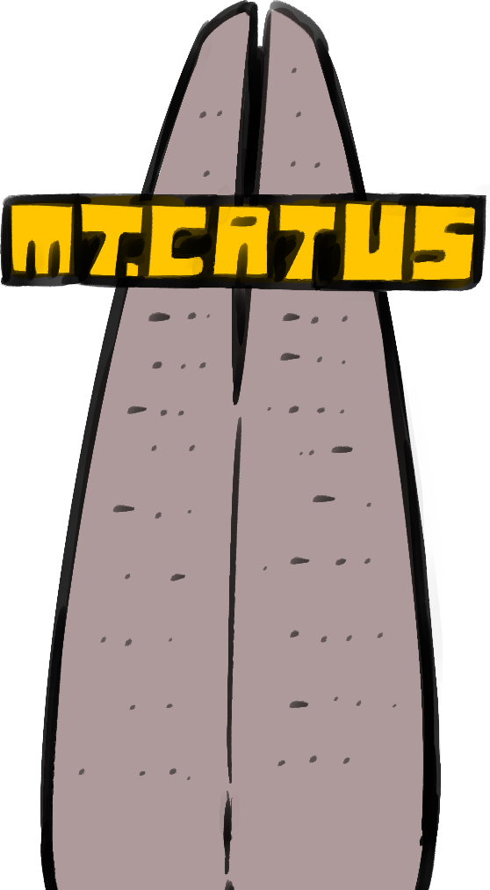
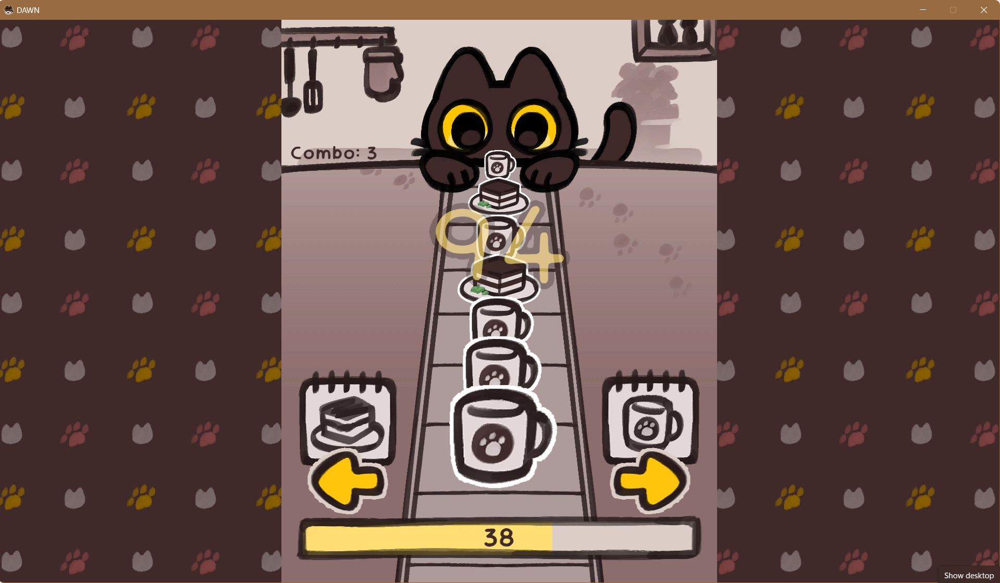

# 🐈‍⬛ DAWN
베이커리 펠리즈에서 이뤄지는 좌충우돌 제과점 타이쿤, **DAWN**.  
  
<ins>※ 게임을 플레이하기 전에 **조작 키를 반드시 확인**하시기를 권해드립니다.</ins>

---

## 📋 목차
1. [게임 PV](#-게임-PV)
2. [프로젝트 기여자](#-프로젝트-기여자)
3. [제작 동기](#-제작-동기)
4. [스토리](#-스토리)
5. [조작 키](#-조작-키)
6. [게임 방법](#-게임-방법)
7. [구현 기능](#-구현-기능)
8. [라이선스](#-라이선스)
9. [참고 자료](#-참고-자료)
10. [개발 현항](#-개발-현항)

---

## 🎥 게임 PV
[](https://www.youtube.com/watch?v=G1nTNvpd6xU)
▲ DAWM PV (95s) : 누르면 해당 링크로 이동합니다.

---

## 👥 프로젝트 기여자
### 최초 개발
- **<a href="https://github.com/Hyuni02" target="_blank"> 전성현 </a>**_DAWN 최초 기획, 게임 로직 구현 및 전체 개발
- **<a href="https://github.com/JisubShim" target="_blank"> 심지섭 </a>**_주방장 구현 및 상호작용 개발, 전체 코드 리팩토링
- **<a href="https://github.com/YohanIm00" target="_blank"> 임요한 </a>**_아트 디자인, 플레이어 구현 등 간단한 개발
### 게임 PV
- **<a href="https://github.com/RuneLune" target="_blank"> 박승용 </a>**_동영상 및 사운드 편집
- **<a href="https://github.com/JisubShim" target="_blank"> 심지섭 </a>**_동영상 제작 및 선별 (Vidu)
- **<a href="https://github.com/YohanIm00" target="_blank"> 임요한 </a>**_PV 시나리오 집필
- **<a href="https://github.com" target="_blank"> 정윤석 </a>**_정지 이미지 제작 (MidJourney)
### 후속 개발
- **<a href="https://github.com/YohanIm00" target="_blank"> 임요한 </a>**_게임 신 재구성 및 추가 기능 구현
- **<a href="https://blog.naver.com/pz_jb_008" target="_blank"> 임다혜 </a>**_게임 전체 아트워크 개편

---

## 💡 제작 동기

DAWN은 게임개발 동아리 PLUM의 여름방학 프로그램인 2024 PLUM JAM에서 탄생한 작품입니다.  
PLUM JAM은 주어진 키워드를 활용하여 게임을 만드는 게임개발 해커톤으로, 당시 키워드는 '티라미수 케이크'와 '풍선'이었습니다.  
이를 어떻게 아우를까 고민하던 끝에, '매우 높은 곳을 풍선 다발로 올라가고자 티라미수를 파는 고양이'로 이야기의 가닥이 잡혔습니다.


---

## 📖 스토리
### 시놉시스

다른 건 다 못해도 티라미수 케이크 만드는 재능 하나만큼은 일품인 검은 고양이 완드.  
어느 날 갑작스레 솟아오른 초거대 캣타워 MT.CATUS에 마음을 완전히 사로잡히고 만다.  
그렇게 넋을 놓고 타워를 오르려던 찰나, 타워의 꼭대기로부터 익숙한 울음소리가 들린다.    
그게 동생이라는 사실을 깨달은 완드는 이 난관을 어떻게 해결할지 고민한다.  
그때 완드의 머리를 엄청난 아이디어가 하나 번뜩이는데,  
  
'티라미수 케이크와 풍선을 맞바꿔서, 그걸 타고 올라가야겠다!'  
  
목표는 풍선 1,000개! 과연 우리의 완드는 풍선을 충분히 모아 동생과 다시 만날 수 있을 것인가...

### 등장인물

▲ 캐릭터 컨셉아트: 왼쪽이 완드, 오른쪽이 푸이다.
- 완드(Wand)
  - 검은 털의 도메스틱 숏헤어 고양이, 호박색 홍채가 돋보인다.
  - 어떤 재료를 가져다 주더라도 그걸 모두 티라미수 케이크로 만들고 만다. 통칭 "티라미수 손".
  - 평소 매우 과묵하여 어떤 말을 하고 싶은지를 못 알아들을 때가 많다.
- 푸(Pu)
  - 스코티시 폴드 종 회색 계열의 무늬가 돋보인다. 보통은 눈을 감고 있는 편.
  - 베이커리 펠리즈의 주방장으로 본인 요리에 자부심이 강하다.
  - 이유는 잘 모르겠지만, 완드가 하고 싶은 말을 매우 잘 알아듣는다.
- (추후 캐릭터 추가 예정)
  - 다음 버전을 기대해주세요!

### 배경
- 달동네
  - 우리네 주변에 보일 법한 흔하디 흔한 달동네. 특이하게도 오직 고양이들만 살고 있다.
- MT.CATUS  
  
  - 달동네 중앙에 난데없이 솟아난 초고층의 "캣 타워"
  - 캣 타워의 상단에는 MT.CATUS라는 간판이 떡하니 붙어 있다.
- 베이커리 펠리즈(Feliz)
  
  - 푸가 운영하는 베이커리.
  - 고양이가 대부분 야행성인 탓인지, 시간이 지날수록 손님이 많아진다.
  - 푸의 흥미 위주로 하는 장사라서 피크 타임에는 되려 문을 닫는다고 한다. 

---

## 🎮 조작 키
### 분류 게임
- **방향키**  
(왼쪽 방향키) 티라미수 주기  
(오른쪽 방향기) 우유 주기

### 메인 게임
- **방향키**  
캐릭터 상하좌우 이동
- **스페이스바**  
컷신 및 대화 신 내 상호작용
- **S**  : **S**erving
(손님) 주문 받기, 완성된 음식 주기  
(주방장) 주문 넣기, 완성된 음식 받기
- **E, R**  : l**E**ft & **R**ight
(E) 왼손에 든 음식 먹기
(R) 오른손에 든 음식 먹기

---

## 🕹️ 게임 방법
### 분류 게임

- 간단한 분류 게임으로 오른쪽 방향키와 왼쪽 방향키만으로 플레이할 수 있습니다.
- 20개의 주문을 연속으로 올바르게 처리한다면 FEVER가 활성화됩니다.
  - FEVER 시간 중에는 어느 방향키를 눌러도 점수가 오릅니다.
  - FEVER는 3초 동안 지속됩니다.
    
- 어떤 상황에서든 방향키를 잘못 누르면 점수가 깎입니다.
  - 현재 점수가 클수록 깎이는 폭도 크게 늘어나므로 주의하도록 합시다.
    
- 제한 시간 안에 최대한 높은 점수를 내보세요!
  - ~해당 점수는 메인 게임의 초기값으로 넘어갑니다.~
  - 넘어가야 했으나, 의도와 달리 제대로 넘어가지 않는 것을 확인했습니다.
  - 관련 문제는 "개발 현황" 단락에서 후술하도록 하겠습니다.

### 메인 게임

- 손님의 주문이 들어오면 손님에게 다가가 S키를 눌러 주문을 받습니다.
  - 제때 주문을 받지 않는다면, 손님이 화가 난 채로 밖을 나가버립니다.
  - 화난 고양이 손님은 그 대가로 풍선을 터뜨려버리니 조심하세요!
    
- 주문을 받고서 주방장(푸)에게 다가가 S키를 누르면 요리를 시작합니다.
  - 주문은 한 번에 10개씩 받을 수 있으며, 동시에 최대 4개의 메뉴를 조리할 수 있습니다.
  - 조리 시간은 메뉴에 따라 3초 혹은 5초가 걸립니다.
    
    

- 요리가 끝나면, 오븐 특유의 요리 완료 소리가 들린 뒤 카운터에 해당 메뉴가 진열됩니다.
  - 마찬가지로 카운터에서 S키를 누르면 완성된 순서대로 요리를 집을 수 있습니다.
  - 요리는 한 번에 두 개씩 들고 다닐 수 있습니다.
    
- 완성된 요리를 들고 손님에게 가서 S키를 누르면 서빙을 할 수 있습니다.
  - 주문한 요리가 맞다면 손님이 이를 맛있게 먹고 바로 풍선을 줄 것입니다.
  - 주문한 요리와 다르다면, 아무 반응을 하지 않습니다. 다시 한 번 주문을 확인하세요!
    
  - 뿐만 아니라 **요리를 손에 든 채**로는 주문을 받을 수 없습니다! 손에 든 걸 먼저 손님께 드린 뒤에 받도록 합시다.
    
- 혹시 서빙 과정에서 착오가 생겨서 음식이 남아버렸다면... E키나 R키를 눌러서 손에 들고 있는 음식을 먹을 수 있습니다.
  - 음식을 먹으면 먹은 후에 포만도가 일정 값 차게 됩니다.
  - 포만도가 가득 차게 될 경우 잠시 동안 느려지므로 주의하세요!
- 제한 시간 안에 풍선 1,000개를 모으면 성공입니다.  

---

## ⚙️ 구현 기능
- **엔진**: Unity
- **프로그래밍 언어**: C#  
- **주요 구현 사항**
  - 싱글톤 패턴 : AudioManager, GameManager 등
    - AudioManager
    ```csharp
    public class AudioManager : MonoBehaviour
    {
        public static AudioManager instance;
        public AudioClip[] bgmClips;
        public float bgmVolume;
        private AudioSource bgmPlayer;
        public enum BGM { MainMenu, Prologue }
    
        private void Awake()
        {
            instance = this;
            Init();
        }
    
        private void Start()
        {
            bgmPlayer.Stop();
    
            if (SceneManager.GetActiveScene().name == "MainMenu")
                PlayBgm(BGM.MainMenu);
            else if (SceneManager.GetActiveScene().name == "Prologue")
                PlayBgm(BGM.Prologue);
        }
    
        private void Init()
        {
            GameObject bgmObject = new GameObject("BGM Player");
            bgmObject.transform.parent = transform;
            bgmPlayer = new AudioSource();
        
            bgmPlayer = bgmObject.AddComponent<AudioSource>();
            bgmPlayer.playOnAwake = false;
            bgmPlayer.loop = true;
            bgmPlayer.volume = bgmVolume;
        }
    
        public void PlayBgm(BGM bgm)
        {
            bgmPlayer.clip = bgmClips[(int)bgm];
            bgmPlayer.Play();
        }
    
        public void VolumeController(float volume)
        {
            bgmVolume = volume;
            bgmPlayer.volume = bgmVolume;
        }
    ```
    : 전체 게임에 계속 관여해야 하는 요소는 싱글톤 패턴을 활용하여 제작했습니다.  
    : 배경 음악은 각 장면마다 정해진 음악이 따로 있으므로 열거형 자료 enum BGM으로 선언하였습니다.  
    : 또한 싱글톤으로 제작된 만큼 함수를 ```AudioManager.instance.VolumeController(0)``` 형태로 어디서든 호출할 수 있습니다.
  
  - 상태 패턴 : Player, Customer
    - CustomerStateMachine.cs
    ```csharp
    public class CustomerStateMachine : MonoBehaviour
    {
        public CustomerState Order;
        public CustomerState Enjoy;
        public CustomerState currentState;
        
        private void Start()
        {
            Order = gameObject.AddComponent<OrderingState>();
            Enjoy = gameObject.AddComponent<EnjoyingState>();
    
            ChangeState(Order);
        }
    
        public void ChangeState(CustomerState newState)
        {
            currentState?.Exit();
            currentState = newState;
            currentState?.Enter(this);
        }
    }
    ```
    - CustomerState.cs
    ```csharp
    public abstract class CustomerState : MonoBehaviour
    {
        protected CustomerStateMachine stateMachine;
        protected Customer customer;
    
        public virtual void Enter(CustomerStateMachine stateMachine)
        {
            this.stateMachine = stateMachine;
            customer = GetComponent<Customer>();
            customer.timer.fillAmount = 1;
        }
    
        public abstract void _Update();
        public abstract void Exit();
    }

    ```
    - EnjoyingState.cs
    ```csharp
    public class EnjoyingState : CustomerState
    {
        private float maxTime;
    
        public override void Enter(CustomerStateMachine stateMachine)
        {
            base.Enter(stateMachine);
            customer.enjoyingTime += Random.Range(0, 2);
            maxTime = customer.enjoyingTime;
            GameManager.instance.GainBalloon(true, customer.menu.GetCookingTime());
        }
    
        public override void Exit() {}
    
        public override void _Update()
        {
            customer.enjoyingTime -= Time.deltaTime;
            customer.timer.fillAmount = customer.enjoyingTime / maxTime;
            
            if (customer.enjoyingTime < 0)
                stateMachine.ChangeState(stateMachine.Leave);
        }
    }
    ```
    : 상호작용에 따라 행동 양상이 달라야 하는 오브젝트는 상태 패턴을 활용하여 제작했습니다.  
    : 모든 상태의 근간이 되는 클래스를 추상클래스로 선언하고 이를 상속하여 각 상태를 구체화했습니다.  
    : 여러 상태를 상황에 맞게 오갈 수 있도록 상태 머신을 만들고, 이를 아래 코드와 같이 주인격이 되는 객체 내부에 삽입하였습니다.
    - Customer.cs
    ```csharp
    public class Customer : MonoBehaviour
    {
        public CustomerStateMachine stateMachine;
    
        private void Awake() { stateMachine = gameObject.AddComponent<CustomerStateMachine>();}
    
        public void Update() { stateMachine.currentState._Update();}
    
        public void OnDestroy() { GameManager.instance.customers.Remove(gameObject); }
    }
    ```
  - DOTWEEN : Cutscene에 들어가는 요소
    - AbstractPart.cs
    ```csharp
    using DG.Tweening;
    
    public abstract class AbstractParts : MonoBehaviour
    {
        protected Image image;
        protected Tween tween;
    
        void OnEnable()
        {
            image = gameObject.GetComponent<Image>();
            StartCoroutine(Alter());
        }
        protected abstract IEnumerator Alter();
    }
    ```
    - LetterTransform.cs
    ```csharp
    using DG.Tweening;
    
    public class LetterTransform : AbstractParts
    {
        protected override IEnumerator Alter()
        {
            Transform transform = image.transform;
            yield return transform.DOPunchScale(new Vector3(0.5f, 0.5f, 0), 0.5f, 10, 1f);
        }
    }
    ```
    : 컷신 내에서 이동, 크기 변형, 페이드, 흔들림 등의 부가 요소는 거의 다 DOTween 라이브러리를 활용하였습니다.  
    : 유니티에서 스프라이트를 다루는 요소는 대부분 SpriteRenderer와 Image로 구성되어 있기 때문에 두 경우를 상정하고 추상 클래스를 만들었습니다.  
    : 실제로 동작하는 함수는 Coroutine의 형식을 빌렸으며, 자식 클래스에서 이를 더욱 상세히 설정하였습니다. 
  - ScriptableObject : 게임 데이터 전반
    - MenuSO
    ```csharp
    public class MenuSO : ScriptableObject
    {
        protected float cookingDuration;
        protected Sprite foodSprite;
    
        public virtual float GetCookingTime() { return cookingDuration; }
        public virtual Sprite GetSprite() { return foodSprite; }
    }
    ```
    - BreadSO
    ```csharp
    [CreateAssetMenu(menuName = "BreadSO")]
    public class BreadSO : MenuSO
    { }
    ```
    - DataManager
    ```csharp
    public class DataManager : MonoBehaviour
    {
        public Dictionary<string, MenuSO> menus = new Dictionary<string, MenuSO>();
    
        private void Start() { LoadMenus(); }
    
        private void LoadMenus()
        {
            MenuSO[] loadData = Resources.LoadAll<MenuSO>("Cuisines");
    
            foreach (MenuSO menu in loadData)
                menus.Add(menu.name, menu);
        }
    }
    ```
    - 게임 내 데이터는 대부분 ScriptableObject 에셋으로 관리했습니다.
    - MenuSO의 에셋을 만들면 내부 값을 유니티 에디터 안에서 수정·관리할 수 있습니다.
    - BreadSO에서 MenuSO를 상속하는 까닭은 추후 추가될 다른 메뉴를 고려했기 때문입니다.
    - DataManager에서는 사전에 만들어진 SO 에셋의 데이터를 불러와서 게임에 반영합니다.

---

## 📜 라이선스
- DAWN은 [CC BY-NC 4.0](https://github.com/YohanIm00/OSS_DAWN/blob/main/LICENSE) 라이선스를 따릅니다.
- 코드의 수정 및 배포는 가능합니다. 앞으로도 꾸준히 개발될 프로젝트이므로 코드 관련하여 피드백주시면 적극 반영하도록 하겠습니다.
- 그러나 게임 내 모든 아트워크는 원저작자가 따로 있습니다. 따라서 해당 프로젝트 내 아트워크 수정 및 상업 목적의 재배포는 지양해주시기 바랍니다.

---

## 📚 참고 자료
### PV
- 동영상 제작 AI Vidu Studio  
  http://www.vidu.studio
- Vidu 프롬프트 작성 가이드  
https://pkocx4o26p.feishu.cn/docx/UCc6dHBE3ohwqxxCgDPcSEMinMc
- MidJourney 공식 문서  
https://docs.midjourney.com/
- Midjourney 프롬프트 제작 채널  
https://www.midjourney.com/auth/signin?callbackUrl=%2Frooms%2F44a30f92-a8c1-470b-a553-86f49add2a7a
- Bao, Fan, et al., "Vidu: a highly consistent, dynamic and skilled text-to-video generator with diffusion models."  
- Cheng, Evelyn. “Chinese AI startup takes aim at OpenAI’s Sora with image-to-video tool launch” 
https://www.cnbc.com/2024/11/14/chinese-ai-startup-shengshu-launches-image-to-video-tool-rivaling-sora.html
- Monge, Jim Clyde. “Vidu is the New AI Video Generator We Should Pay Attention to” 
https://generativeai.pub/vidu-is-the-new-ai-video-generator-we-should-pay-attention-to-e6a12a07fe97

### 게임
**[영감]**
- Disney·Pixar 영화 "업(2009)"  
  https://www.disneyplus.com/en-kr/movies/up/3XiRSXriK0E8
- 컴투스, 액션퍼즐패밀리 "삼촌의 니편 내편"  
  https://namu.wiki/w/%EB%8F%8C%EC%95%84%EC%98%A8%20%EC%95%A1%EC%85%98%20%ED%8D%BC%EC%A6%90%20%ED%8C%A8%EB%B0%80%EB%A6%AC#s-2.3  
  https://www.youtube.com/watch?v=IcLeiSNtSkA&t=9s
- 아툰즈, 비비빅 "뿌띠빠띠"  
  https://namu.wiki/w/%EB%BF%8C%EB%9D%A0%EB%B9%A0%EB%9D%A0  
  https://www.youtube.com/watch?v=trNmfPZuuaM

**[개발]**
- Unity 공식 문서  
  https://unity.com/
- 골드메탈_유니티 게임 개발 플레이리스트  
  https://www.youtube.com/@goldmetal/playlists
- Sunny Valley Studio_How to reuse Animation Clip for other characters in Unity  
  https://www.youtube.com/watch?v=6mNak-mQZpc
- Root Games_(FREE COURSE) Make awesome CUTSCENES in Unity using Timeline  
  https://www.youtube.com/watch?v=MpYIoAoE0bE&t=134s
- Tarodev_DOTWEEN is the BEST Unity asset in the WORLD and I'll fight anybody who disagrees  
  https://www.youtube.com/watch?v=Y8cv-rF5j6c
- David Dunnings_EaseyEase - All 41 ease types  
  https://www.youtube.com/watch?v=uhEZ8hzwPTU
- WER's GAME DEVELOP YOUTUBE_[Unity/MiddleClass] Scriptable Object  
- https://www.youtube.com/watch?v=7Qt4QNhM4nY
- 상태(State) 패턴 - 완벽 마스터하기  
  https://inpa.tistory.com/entry/GOF-%F0%9F%92%A0-%EC%83%81%ED%83%9CState-%ED%8C%A8%ED%84%B4-%EC%A0%9C%EB%8C%80%EB%A1%9C-%EB%B0%B0%EC%9B%8C%EB%B3%B4%EC%9E%90

**[에셋]**
- Modern Interiors RPG Tileset  
  https://limezu.itch.io/moderninteriors
- DOTWEEN PlugIn  
  https://dotween.demigiant.com/
- KoreanTyper  
  https://github.com/KimYC1223/KoreanTyper
- 배경음악  
  https://pixabay.com/music/acoustic-group-corporate-ukulele-optimistic-light-262592/  
  https://pixabay.com/music/modern-classical-the-way-home-6674/  
  https://pixabay.com/music/traditional-jazz-wiggle-until-you-giggle-217437/  
  https://pixabay.com/music/smooth-jazz-10-chocolate-lofi-cafe-upbeat-257740/  
  https://pixabay.com/music/traditional-jazz-cafe-music-163375/  
  https://pixabay.com/music/acoustic-group-calm-acoustic-60-seconds-267027/  
  https://pixabay.com/music/jingles-piano-cassical-brand-motive-logo-9997/
- 효과음  
  https://pixabay.com/sound-effects/menu-selection-102220/  
  https://pixabay.com/sound-effects/90s-game-ui-7-185100/  
  https://pixabay.com/sound-effects/ui-click-43196/  
  https://pixabay.com/sound-effects/quake-and-break-99034/  
  https://pixabay.com/sound-effects/kitten-meowing-105618/  
  https://pixabay.com/sound-effects/ding-idea-40142/  
  https://pixabay.com/sound-effects/piano-glide-259500/  
  https://pixabay.com/sound-effects/referee-whistle-blow-gymnasium-6320/  
  https://pixabay.com/sound-effects/bellding-254774/  
  https://pixabay.com/sound-effects/correct-2-46134/  
  https://pixabay.com/sound-effects/wrong-47985/  
  https://pixabay.com/sound-effects/door-chimes-66502/  
  https://pixabay.com/sound-effects/bell-chime-238836/  
  https://pixabay.com/sound-effects/cali-meow-242762/  
  https://pixabay.com/sound-effects/annoyed-cat-meow-193067/  
  https://pixabay.com/sound-effects/short-meow-kitten-230900/  
  https://pixabay.com/sound-effects/cookies-are-ready-95956/  
  https://pixabay.com/sound-effects/place-glass-object-81857/  
  https://pixabay.com/sound-effects/balloon-pop-48030/  
  https://pixabay.com/sound-effects/electricity-sound-6066/  
  https://pixabay.com/sound-effects/spotlight-91359/

---

## 🛠️ 개발 현항
### 개발 완료
- 메인 메뉴 디자인
- 플레이어, NPC 등의 요소
- 서브 분류 게임
- 메인 타이쿤 게임
- 다이얼로그 시스템
- 게임 종료와 장면 간 이동
- 오디오 매니저

### 현재 과제
- ScriptableObject의 한계
  - 유니터 에디터 내에서는 값을 쓰고 불러오는 게 가능했으나, 빌드 이후에는 불가능
  - 달리 말하면, 빌드 이후에는 유니터 에디터에서 가장 마지막에 변경한 값만 불러옴
  - ScriptableObject는 저장해둔 데이터를 불러오는 데에는 유용하게 쓸 수 있는 것으로 보임
  - 그러나 해당 ScriptableObject의 값을 특정 신에서 바꾸는 것은 되지 않는 것으로 판명
- 내부 구조 문제
  - 초기 게임부터가 20시간 만에 만들어지다 보니, 구조가 다소 뒤죽박죽인 면이 있음
  - 싱글톤 패턴이 과도하게 쓰여서 게임을 확장할수록 메모리 관리에 난항을 겪을 가능성이 큼
- 가끔씩 한 자리에 두 명의 손님이 앉는 경우
- 플레이어가 먹는 행동과 관련한 몇몇 버그
  - 타이밍에 따라 먹는 동안 이동이 되거나 먹고 나서 이동이 안 되는 등 문제가 많다...
  - 게임의 밸런스 측면에서도 Munch()는 반드시 개선해야 한다: 플레이어가 활용할 수 있는 하나의 도구가 되었으면 함

### 향후 계획
- json을 활용하여 저장해야 데이터를 따로 관리
  - 현재 풍선의 개수 외에도 따로 관리가 되어야 할 데이터를 구분
  - DataManager나 StageManager 등의 객체를 구현하여 스테이지에 따라 필요한 데이터를 불러오는 식으로 구현
- 게임 전체 구조 리팩토링
  - 싱글톤 패턴 최소화 (GameManager, AudioManager 정도)
  - 주방장에 상태 패턴 적용 및 보수
  - GameManager나 CustomerSpawner 등에 과도하게 붙은 기능 분화
  - UIManager 추가나 DataManager의 기능 보수 등으로 해당 상황 타개 (SOLID 기법 적용)
- 상기한 버그 해결 및 추가 기능 구현
  - 포만도가 가득 찰 시 주방장이 화면 밖의 플레이어를 노려보는 애니메이션 추가 등
- 메인 메뉴 내 설정 버튼 추가
  - 조작키를 플레이어의 입맛에 맞게 바꿀 수 있는 기능
  - 여느 게임에나 있는 BGM, SFX 볼륨 크기 조정
- 메인 게임 내 요소 추가 구현
  - 티라미수 케이크 주문 시 화면에 미니게임 표시
- 전체 스토리 확장 및 캐릭터 추가
- 도트 그래픽 작업 완수, 게임에 추가 반영
